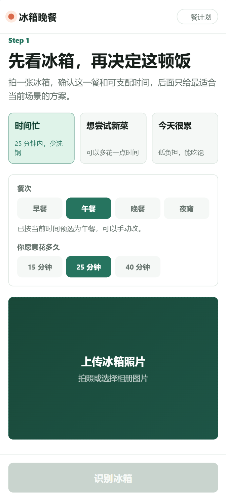
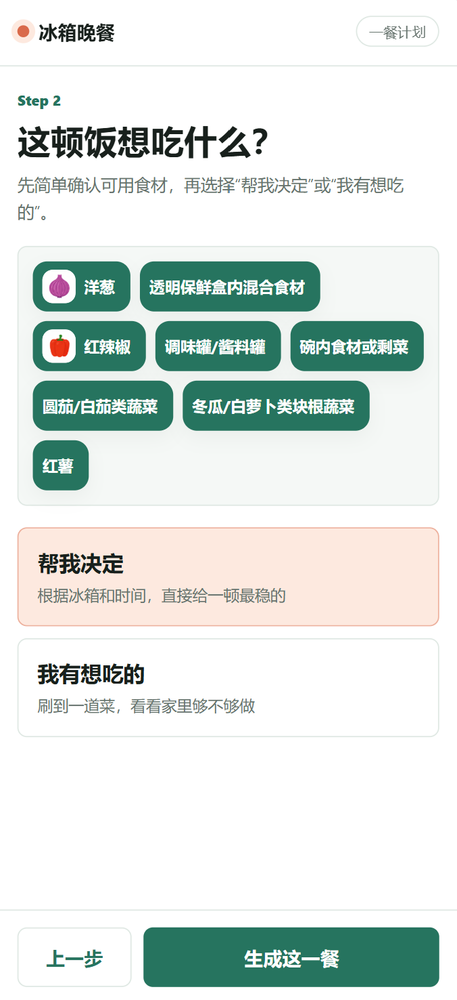

# 冰箱晚餐 Agent 体验流程

## 一、体验准备

### 1.1 环境启动

需要启动两个本地服务，**分别开两个终端窗口**：

**终端一：启动后端 API 服务**

```bash
cd douyinai
cp .env.example .env.local
# 编辑 .env.local，填入你的 API Key
```

启动命令按终端环境选择：

**macOS / Linux (bash/zsh)：**

```bash
PORT=4174 npm run dev
```

**Windows PowerShell：**

```powershell
$env:PORT=4174; npm run dev
```

**Windows Git Bash：**

```bash
PORT=4174 npm run dev
```

> 如果遇到 `PORT=4174 : 无法将"PORT=4174"项识别为 cmdlet` 的错误，说明正在 PowerShell 中使用 Unix 语法，请改用上方的 PowerShell 命令。

启动成功后终端显示：

```
冰箱晚餐 Agent demo: http://localhost:4174/
Model: gpt-5.5
```

**终端二：启动前端展示页面**

首次使用需先安装前端依赖：

```bash
cd douyinai/frontend
npm install
```

依赖安装完成后，回到 `douyinai` 目录启动前端：

```bash
cd ..
npm run showcase
```

启动成功后打开：

```
http://localhost:5173/
```

### 1.2 配置检查

打开 http://localhost:4174/api/health ，正常应返回：

```json
{
  "ok": true,
  "hasApiKey": true,
  "model": "gpt-5.5"
}
```

如果 `hasApiKey: false`，说明 `.env.local` 未填 API Key 或未重启服务。

---

## 二、主流程体验（三步完成晚餐决策）

### 第一步：上传冰箱照片

打开 http://localhost:5173/ ，点击上传按钮，选择：

- **方式 A**：上传自己拍的冰箱照片



- **方式 B**：使用项目内置样例图（`assets/fridge-images/` 目录）

### 第二步：识别并确认食材

1. 选择餐次（早餐 / 午餐 / 晚餐 / 夜宵），页面会根据当前时间自动选中
2. 选择可支配时间（15 分钟 / 25 分钟 / 40 分钟）
3. 选择当前状态（时间忙 / 想尝试新菜 / 今天很累）
4. 点击**「识别冰箱」**，等待 AI 返回识别结果
5. 查看识别出的食材列表，**取消勾选**明显错误的食材




> 视觉识别结果会标注不确定项，用户确认后才进入推荐。不确定食材不会被硬编进方案。

### 第三步：生成今晚方案

选择路线：

**路线 A — 帮我决定**
- 点击「帮我决定」→ 点击「生成这一餐」
- 输出：保底菜、进阶菜、缺料补买清单、兜底外卖建议、安全提醒


**路线 B — 我有想吃的（复刻目标菜）**
- 点击「我有想吃的」
- 输入菜名（如"番茄牛腩"）或上传目标菜图片
- 点击「判断复刻路线」
- 输出：能否复刻、简化版本、今晚准备路线、缺料补买建议

### 第四步：查看结果并执行

方案页展示：

- **做什么**：今晚最现实的一顿饭
- **为什么适合**：结合当前时间、厨艺、精力给出的理由
- **现在就做的步骤**：简明操作指引
- **用到哪些已有材料**
- **还缺什么**：缺料补买清单（可点击「加入购物车」跳转抖音商城模拟）
- **饭后**：可点击「拍成品，发抖音」生成内容记录入口

点击「重新规划」保留冰箱识别结果；点击「换一张冰箱重新看」回到第一步。

---

## 三、常见问题自查

| 问题 | 原因 | 解决 |
|------|------|------|
| 点击识别后报 `500` | 后端服务未启动，或端口不对 | 确认终端一运行在 4174 端口（见上方启动命令） |
| 点击识别后报 `failed to fetch` | 服务已停止，或页面通过 `file://` 打开 | 重启服务，用 `http://localhost:4174/` 访问 |
| `api/health` 显示 `hasApiKey:false` | `.env.local` 未填 Key | 编辑 `.env.local` 填入 API Key 后重启服务 |
| 识别结果和图片不符 | 视觉识别存在误差 | 在食材列表取消勾选错误项，人工纠正后继续规划 |
| 模型超时 | 网络或中转站不稳定 | 项目有本地缓存兜底，超时后自动切换缓存，保证演示不中断 |